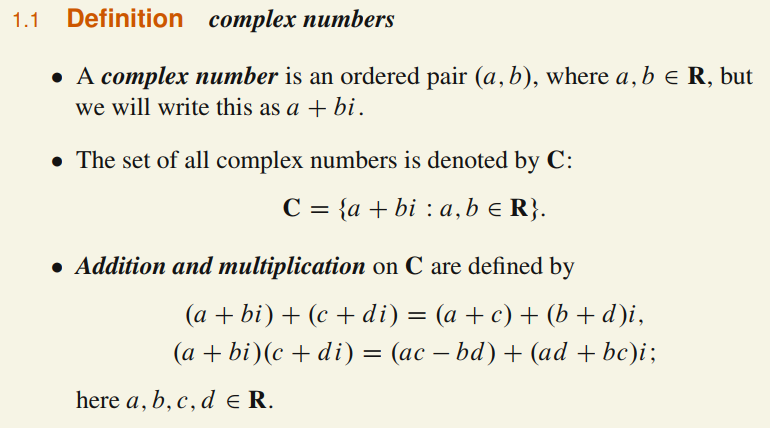
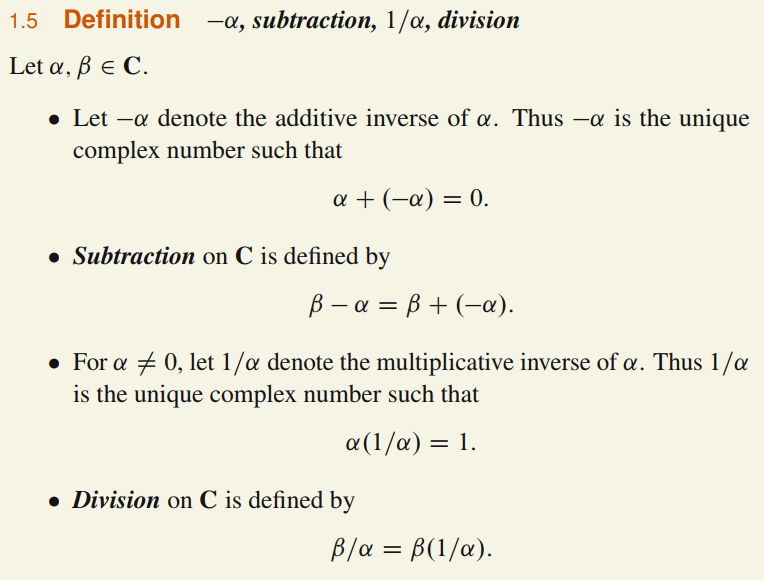
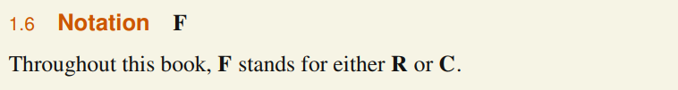
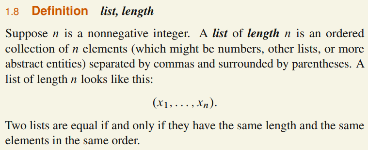

# Vector Space

## 1.A: Rn and Cn

### Complex Numbers

* * *

### Lists

* * *

### Fn

#### 1.10 Definition $\mathbf{F}^n$
$\mathbf{F}^n $ is the set of all lists of length n of elements of $\mathbf{F}$:

$$ \mathbf{F}^n = \{ (x_1, x_2, \dots, x_n ) \; : \; x_j  \;  for \; j = 1,2,\cdots,n   \}
$$

For $ \; (x_1,...,x_n) \in \mathbf{F}^n \; $ and $ \; j \; \in \{1,...,n\}
$ we say that $ x_j $ is the $ j^th $ ***coordinate*** of $(x_1,...,x_n)$

#### 1.12 Definition addition in $\mathbf{F}^n$
***Addition*** in $\mathbf{F}^n$ is defined by adding corresponding coordinates:
$$ (x_1,...,x_n)+(y_1,...,y_n)=(x_1+y_1,...,x_n+y_n) $$

#### 1.13 Commutativity of addition in $\mathbf{F}^n$
If $ x,y \in \mathbf{F}^n \; then \; x + y = y + x$

#### 1.14 Definition 0
Let 0 denote the list of length $n$ whose coordinates are all 0:
$$0 = (0,...,0).$$

#### 1.16 Definition ***additive inverse*** in $\mathbf{F}^n$
For $ x \in \mathbf{F}^n$, the ***additive inverse*** of $x$, denoted $-x$, is the vector $ x \in \mathbf{F}^n$
such that

$$ x + (-x) = 0 $$

In other words, if $x=(x_1,...,x_n)$, then $-x = (-x_1,...,-x_n)$.

#### 1.17 Definition ***scalar multiplication*** in $\mathbf{F}^n$
The ***product*** of a number $\lambda$ and a vector in $\mathbf{F}^n$ is computed by multiplying
each coordinate of the vector by $\lambda$:
$$\lambda(x_1,...,x_n) = (\lambda x_1,...,\lambda x_n) $$
here $\lambda \in \mathbf{F}$ and $ (x_1,...,x_n) \in \mathbf{F}^n $.

* * *

## 1.B: Definition of Vector Space

#### 1.18 Definition addition, scalar multiplication

- An ***addition*** on a set $\mathbf{V}$ is a function that assigns an element $u+v \in \mathbf{V}$ to each pair of elements $ u,v \in \mathbf{V} $

- A ***scalar multiplication*** on a set $\mathbf{V}$ is a function that assigns an element $\lambda v \in \mathbf{V}$ to each $\lambda \in \mathbf{F}$ and $v \in \mathbf{V}$.

#### 1.19 Definition vector space
A ***vector space*** is a set $\mathbf{V}$ along with an addition on $\mathbf{V}$ and a scalar multiplication on $\mathbf{V}$ such that the following properties hold:

- **commutativity**
$$u + v = v + u, \; \forall u,v \in \mathbf{V} $$
- **associativity**
$$ (u+v) +w = u+(v+w) , \; \forall \; u, v, w \in \mathbf{V} $$
- **additive identity**
  $$\exists 0 \in \mathbf{V} \; s.t. \; v + 0 = v, \; \forall v  \in \mathbf{V} $$

- **additive inverse**
$$\forall v  \in \mathbf{V},\; \exists w \in V \; s.t. \; v + w = 0$$
- **multiplicative identity**
$$1v = v, \; \forall v \in \mathbf{V} $$
- **distributive properties**
$$a(u + v) = au + av \; and \; (a + b)v = av + bv,\; \forall a, b \in \mathbf{F} \; and \; \forall u,v \in \mathbf{V}$$

#### 1.20 Definition ***vector***, ***point***
Elements of a vector space are called ***vectors*** or ***points***.

#### 1.21 Definition ***real vector space, complex vector space***
- A vector space over $\mathbf{R}$ is called a ***real vector space***.
- A vector space over $\mathbf{C}$ is called a ***complex vector space***.

#### 1.23 Notation $\mathbf{F}^S$
- If $\mathbf{S}$ is a set, then $\mathbf{F}^S$ denotes the set of functions from $\mathbf{S}$ to $\mathbf{F}$.
- For $f,g \in \mathbf{F}^S$, the sum $f+g \in \mathbf{F}^S$ is the function defined by
$$ f+g(x) = f(x)+g(x) ,\; \forall x \in \mathbf{S}$$
- For $\lambda \in \mathbf{F} $ and $f \in \mathbf{F}^S$ , the ***product*** $\lambda f \in \mathbf{F}^S$ is the function defined by
$$ (\lambda f)(x) = \lambda f(x) ,\; \forall x \in \mathbf{S} $$

#### 1.25 Unique additive identity
A vector space has a unique additive identity.

#### 1.26 Unique additive inverse
Every element in a vector space has a unique additive inverse.

#### 1.28 Notation $\mathbf{V}$
For the rest of the book, $\mathbf{V}$ denotes a vector space over $\mathbf{F}$.

#### 1.29 The number 0 times a vector
$0v=0 ,\; \forall v \in  \mathbf{V}$.

#### 1.30 A number times the vector 0
$a0 = 0 ,\; \forall a \in \mathbf{F}$

1.31 The number 1 times a vector
$(-1)v = -v ,\; \forall v \in \mathbf{V}$

* * *

## 1.C: Subspaces

#### 1.32 Definition ***subspace***
A subset $\mathbf{U}$ of $\mathbf{V}$ is called a subspace of $\mathbf{V}$ if $\mathbf{U}$ is also a vector space
(using **the same addition and scalar multiplication** as on $\mathbf{V}$)

#### 1.34 Conditions for a subspace
A subset $\mathbf{U}$ of $\mathbf{V}$ is a subspace of $\mathbf{V}$ if and only if $\mathbf{U}$ satisfies the following three conditions:
- additive identity
$$0 \in \mathbf{U}$$
- closed under addition
$$u,w \in \mathbf{U} \implies u+w \in \mathbf{U}$$
- closed under scalar multiplication
$$a \in \mathbf{F} \; and \; u \in \mathbf{U} \implies au \in \mathbf{U}$$

* * *

### Sum of Subspaces

* * *

### Direct Sum

* * *
