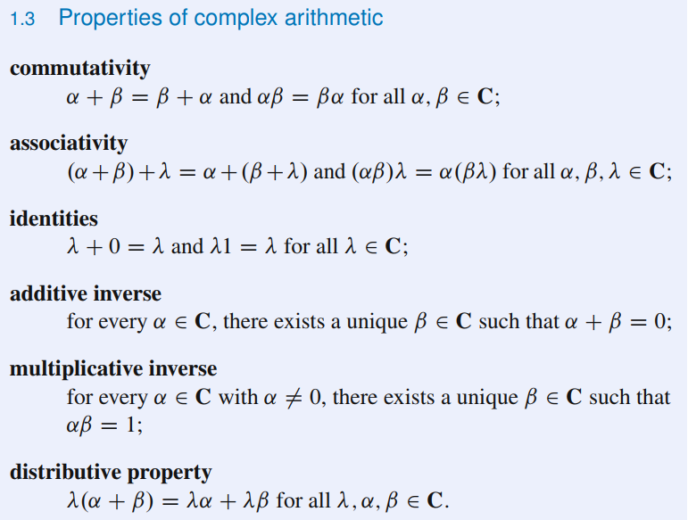

# Vector Space

## 1.A: Rn and Cn

### Complex Numbers

* * *

### Lists

* * *

### Fn

* * *

### Digression on Fields

* * *

## 1.B: Definition of Vector Space

## 1.C: Subspaces

* * *

### Sum of Subspaces

* * *

### Direct Sum

* * *
